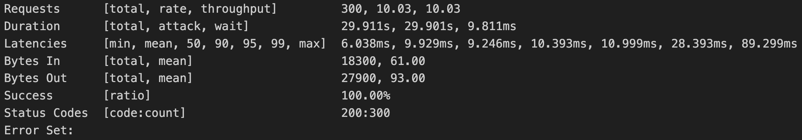
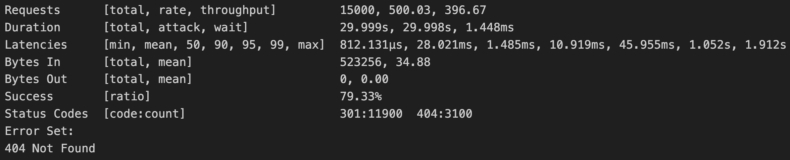

# Summary

This is an URL shortener service supports 2 APIs

* Submit an URL and generate a corresponding shortened URL
  * Re-submit an existing URL will be considerd as an update, which will be useful if you want to extend the expriation, or expire immidietly by setting the expiration in a past time
  * Submission with out an expiration will be considered as no expiration, a.k.a permanent available
  * The 2 function above are controlled by individual feature flags under `config.yaml`, they are both enabled now.
* Access a shorterned URL and redirected to the original url, or return 404 if the shorterned URL is invalid

For client side example, kindly checkout the postman collection in `/postman`

## To run the service

Every steps are packed in the makefile, to start the service

``` bash
 > make build
 > make run
```

Or simply use

``` bash
 > make update
```

## Tech stack breakdown

The service is based on golang gin + mysql + gorm + redis + zap + docker

Using vegeta for benchmarking

* Gin
  * Light weight
  * Decent panic handling
  * Actively maintained
  * Who would turn down gin anyways?
* Mysql
  * Suitable for read heavy service ([ref](https://aws.amazon.com/tw/compare/the-difference-between-mysql-vs-postgresql/))
  * Handy for small scale/POC project.
* gorm
  * Powerful golang orm
  * Provides flexible database CRUD interface
  * ACID support (not applicable to this project though)
* Redis
  * Straight forward key-value cache service
* Zap
  * Mature logging package by Uber
  * Syntactic sugar, makes it easy to use
* Docker
  * Environment isolation and management
  * Friendly to modern cloud architecture
* Vegeta
  * Convenient tool for benchmarking
  * Friendly for creating test data over simple scripting

## Benchmark

To execute the benchmark, follow the command below:

``` bash
 > make vegeta
```

Note that vegeta and python3 are manditory for the execution.

After execution, run

``` bash
 > make cleanup
```

To remove all the generated data.

Result preview:

* POST benchmark
  * 
  * The benchmark was made under 10 qps for 30 seconds
* GET benchmark
  * 
  * The benchmark was made under 500 qps for 30 seconds
  * Since the get requests contains invalid urls, there are 404 errors as the result based on the requirements
  * There are several peak values for the duration, could be caused by the high loading and the newly queried data wasn't cached.

## Things could be done but not yet to be implemented

1. Add a feature to customize shorterned URL
2. Add a simple web page for the shortern service
    1. Could consider creating corresponding QR code upon URL creation for convenience.
    2. Could create an user based home page to show all the created short url
3. Content based shorten, similar to CDN or content hosting service
4. Password for private content
5. Some more unit tests
